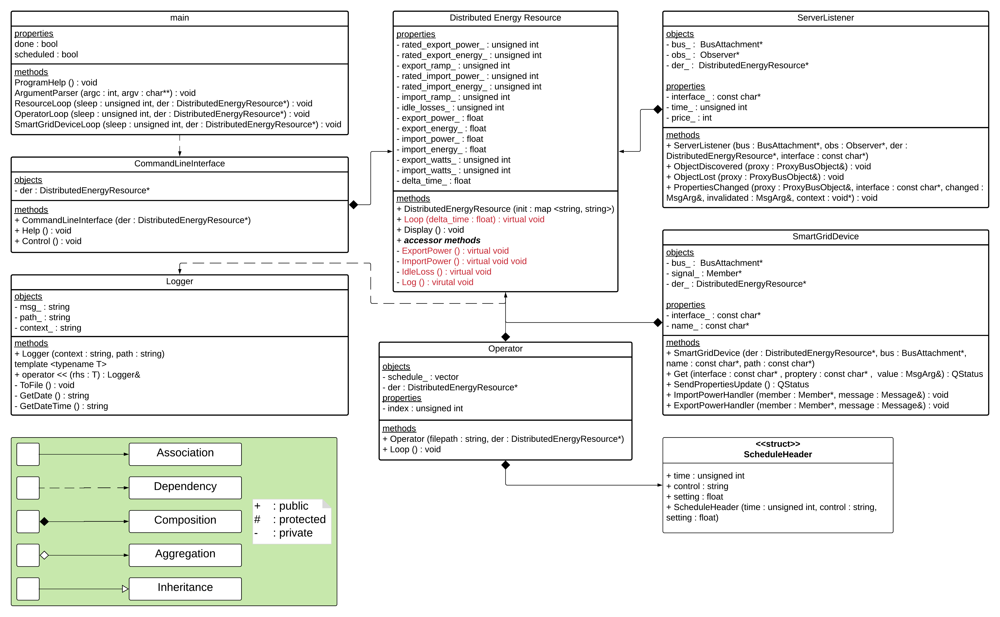

# DCS (Distributed Control System)

## Dependancies
### Linux Environment
``` console
sudo apt-get update
sudo apt-get upgrade
sudo apt-get install git build-essential gcc g++ cmake make xsltproc scons doxygen graphviz libgtk2.0-dev libssl-dev libxml2-dev libcap-dev
mkdir ~/dev ~/src
```

### OpenVPN
The DCS used OpenVPN to extend AllJoyn's routing capability to the wide area network. It is not an ideal solution, but it is relativly easy to setup and can handle a couple hundred clients. Request <client>.ovpn file link through PSU powerlab google drive. In the commands below replace <path> and <client-name> with the actual path to the ovpn file and the actual ovpn file name. 
        
``` console
sudo apt-get update
sudo apt-get install openvpn
cd <path>
chmod 700 <client-name>.ovpn
sudo mv <client-name>.ovpn /etc/openvpv
```

Note: the current vpn setup does not allow internet access through the vpn and setting up a split-tunnel with AllJoyn is difficult. Ensure you have updated all the things you need to update before starting the OpenVPN client.

### AllJoyn
First clone the AllJoyn repository into your /src folder. The run the following "scons" command that corresponds to your processor. 
``` console
cd ~/src
git clone https://github.com/alljoyn/core-alljoyn
cd core-alljoyn
```

#### x86 and x86_64 processors
``` console
scons BINDINGS=cpp WS=off DOCS=html
```

#### ARM processors
``` console
scons OS=linux CPU=arm CROSS_COMPILE=/usr/bin/arm-linux-gnueabihf- BINDINGS=cpp WS=off DOCS=html
```

#### Test AllJoyn Installation
Note: the CPU variable is dependant on your system. 
``` console
export CPU=x86_64
export AJ_LIB=~/src/core-alljoyn/build/linux/$CPU/debug/dist/cpp/lib
export LD_LIBRARY_PATH=$AJ_LIB:$LD_LIBRARY_PATH

cd $AJ_LIB
cd ../bin/samples
./AboutService
```
If the BusAttachment/AboutObj succeed, then the installation should be fine.

## Install
``` console
cd ~/dev
git clone https://github.com/psu-powerlab/DCS
```

### Setup
1. Open /DCS/tools/build-run.sh
2. Modify "CPU" to reflect the system you are working on
3. Ensure "AJ_ROOT" path is correct
4. The program arguments can be modified to change config file path and enable the auto operator.

### Program Arguments
#### Config File (required)
The config file holds the initialization variables for the DCS program.

-c ../data/config.ini

#### Operator (default y)

-o y/n

### Run
Open a terminal an start the vpn client.
``` console
sudo openvpn --config /etc/openvpn/<client-name>.ovpn
```

Next open another therminal and start the dcs.
``` console
cd ~/dev/DCS/tools
./build-run.sh
```

## Use
The program can be controlled three ways:
1. The method handlers built into the "Smart Grid Device" that execute when an AllJoyn method call is recieved.
2. The Command Line Interface (CLI).
3. The Operator that uses a predetermined schedule.

```
        [Help]
> q             quit
> h             help
> i <watts>     import power
> e <watts>     export power
> o <y/n>       operator enable/disable
> p             print properties
```

## Class UML

<p align="center">
  
</p>
